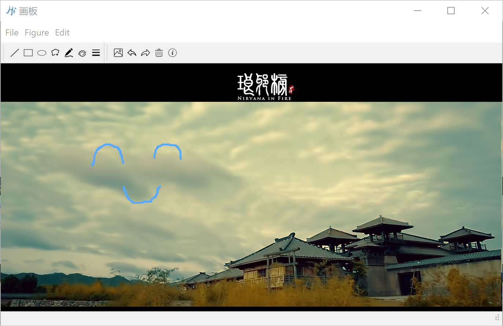

## Lab1-简易画板

By PB17111585 张永停 at 2020.2.24

### 一、实验内容

- 使用Qt实现一个简易画板，具有以下功能

  - 画直线、椭圆、长方形、任意多边形、任意轨迹(FreeHand)
  - 改变线条颜色、粗细
  - 撤销、恢复、清空屏幕
  - 添加图片涂鸦

- 检查内存泄漏

  

### 二、代码框架

##### (一)Shape类

- public
  - `virtual void Draw(QPainter &paint)=0`   作图函数
  - `set_start(QPoint s),set_end(QPoint e)`  设置起止点的信息
  - `get_start(),get_end()`  得到起止点的信息
  - `set_line(QColor line_color,int line_width)`  设置笔的颜色和粗细
- protected
  - `start,end,color,width` 记录当前笔的信息
- `Elli`，`Rect`，`FreeHand`，`Line`，`Poly`继承自`Shape`
  - `Elli,Rect,Line`使用Qt自带的作图函数绘制
  - `Poly,FreeHand` 在之后的算法设计中详述

##### (二)MiniDraw

> 用于显示工具栏和菜单以及对应的动作

- public
  - `QMenu,QToolBar,QAction` ，菜单，工具栏
  - `Creat_Menu(), Creat_ToolBar(),Creat_Action()`等函数，定义动作
- signals
  - `change_color,change_width` 改变笔性质的信号，由`ViewWidget`中的相关函数接收

##### (三)ViewWidget

> 用于接收信号绘制图形

- public
  - `mousePressEvent,mouseMoveEvent,mouseReleaseEvent,paintEvent`
- public slots
  - `setLine(),setRect(),...,setColor()`选择当前绘图种类以及画笔属性
  - `setBackground(),undo(),redo(),clear()`插入图片，撤销，恢复，清空画布
- private
  - `vector<Shape*> shape_list_ `存储当前画布上的所有图形，每次画图时全部画一遍
  - ` vector<Shape*> redo_shape_list` 用于撤销时恢复，把撤销时的图形放入
  - `Shape::Type type_` 当前所画图形的种类
  - `bool draw_status_` 是否绘画
  - `bool stop_polygon` 是否停止绘制多边形。使用这个是因为我们用单击右键来结束多边形绘制，但也许用户并不喜欢这么做，因此添加该变量，便于撤销时的代码

### 三、算法设计

> 本部分简要叙述多边形，随手画，撤销以及恢复的做法，其余比如改变颜色，背景板比较简单，不再赘述

##### (一)多边形

- 继承于`Shape`，添加`vector`来存储多边形的顶点
- `mousePressEvent`中，左键代表开始绘制图形，右键表示结束绘制多边形
  - 如果当前鼠标左击，图形选择是`Ploy`，那么将该点加入`vector`
  - 增加`stop_polygon`来判断多边形是否绘制完成

##### (二)随手画

- 以`QPoint(0,0)`作为间隔点塞入`shape_list`，这样可以方便的知道随手画什么时候开始，什么时候结束
- `mouseMoveEvent`中，将鼠标每次移动作为一条短线段加入`shape_list`
- `mouseReleaseEvent`中，加入间隔点来标记结束

##### (三)撤销

- 除了随手画，其余撤销较简单，仅需将当前`shape_list`队尾元素删除即可，并在`redo_shape_list`添加删除的图形以便恢复
- 对于随手画，使用`while`循环逐个删除`shape_list`中的元素（同时也在`redo_shape_list`中加入删除的元素），直到找到一个作为间隔点存在的`QPoint(0,0)`，这代表一个随手画的开始，删除到这里，意味着删除了该随手画

##### (四)恢复

- 除了随后画，其余图形恢复只需要将`redo_shape_list`弹出
- 对于随手画，仍旧循环直到间隔点

### 四、总结

- 视频演示见同文件目录
- 这次作业拖的比较晚，导致很多地方其实可以改进，比如撤销多边形其实可以写每次只撤销一条边而不是所有，撤销随手画可以一次只撤销一点
- 写Qt的时候痛苦万分，写报告的时候再过一遍代码感觉其实不难，感谢助教的轮子！

