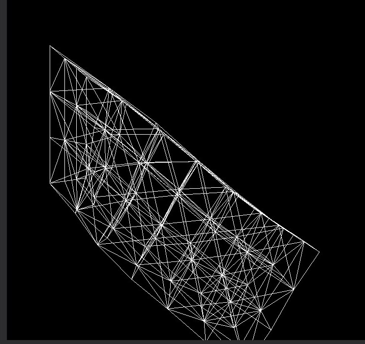
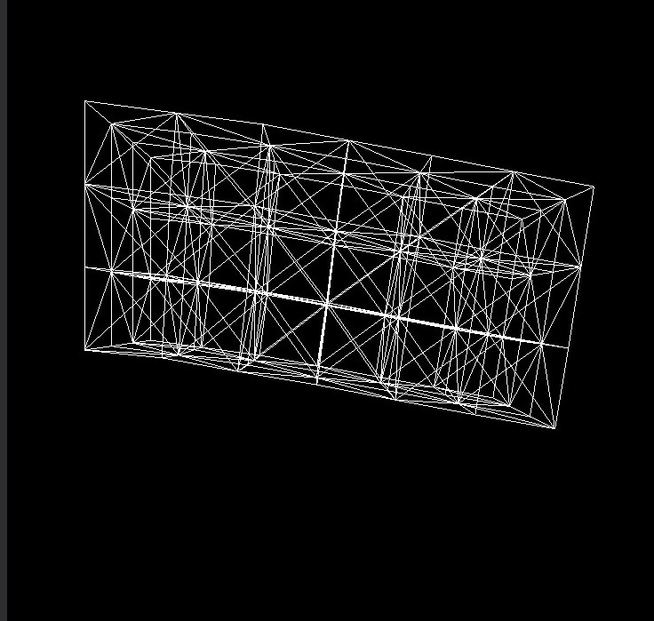

## Lab6 质点弹簧系统仿真

By PB17111585 张永停

### 一、实验内容

- 在给定的网格框架上完成作业，实现 
  - 质点弹簧仿真模型的欧拉隐式方法

  - 质点弹簧仿真模型的加速模拟方法​

    

### 二、算法描述

#### （一）欧拉隐式方法

- 

$$
\boldsymbol x_{n+1}=\boldsymbol x_n+h\boldsymbol v_{n+1},\\
\boldsymbol v_{n+1}=\boldsymbol v_n+h\boldsymbol M^{-1}(\boldsymbol f_{int}(t_{n+1}) +\boldsymbol f_{ext})
$$

​	记
$$
\boldsymbol y =\boldsymbol x_n + h\boldsymbol v_n + h^2\boldsymbol M^{-1}\boldsymbol f_{ext}, \tag{*}
$$
​	则原问题转化为求解关于$\boldsymbol x$的方程：
$$
\boldsymbol g(\boldsymbol x) = \boldsymbol M(\boldsymbol x-\boldsymbol y) -h^2\boldsymbol f_{int}(\boldsymbol x) = 0,
$$
​	利用牛顿法求解该方程,考虑到程序运行时间，至多迭代50次，若50次后还未收敛，直接计算下一帧
$$
\boldsymbol x^{(k+1)}=\boldsymbol x^{(k)}-(\nabla \boldsymbol g(\boldsymbol x^{(k)}))^{-1}\boldsymbol g(\boldsymbol x^{(k)}).
$$
​	迭代初值选为$\boldsymbol x^{(0)}=y$ .

​	迭代得到位移$x$后更新速度$v_{n+1}=(x_{n+1}-x_{n})/h$

- 关于$(\nabla \boldsymbol g(\boldsymbol x^{(k)})$，$\boldsymbol g(\boldsymbol x^{(k)})$可以看作n个3\*3的矩阵对角排列，对每个点的梯度拼接即可

  设单个弹簧（端点为$\boldsymbol  x_1$，$\boldsymbol  x_2$），劲度系数为$k$，原长为$l$，有：

$$
\boldsymbol x_1所受弹力：     \boldsymbol f_1(\boldsymbol x_1,\boldsymbol x_2)=k(||\boldsymbol x_1-\boldsymbol x_2||-l)\frac{\boldsymbol x_2-\boldsymbol x_1}{||\boldsymbol x_1-\boldsymbol x_2||},\\\boldsymbol x_2所受弹力：     \boldsymbol f_2(\boldsymbol x_1,\boldsymbol x_2)=-\boldsymbol f_1(\boldsymbol x_1,\boldsymbol x_2),
$$

​		对
$$
\boldsymbol h(\boldsymbol x)=k(||\boldsymbol x||-l)\frac{-\boldsymbol x}{||\boldsymbol x||},
$$
​		求导有
$$
\frac{ d  \boldsymbol h}{d \boldsymbol x} = k(\frac{l}{||\boldsymbol x||}-1)\boldsymbol I-kl||\boldsymbol x||^{-3}\boldsymbol x \boldsymbol x^T.
$$
​		带入弹力公式得：
$$
\frac{\partial  \boldsymbol f_1}{\partial \boldsymbol x_1} =\frac{\partial  \boldsymbol h(\boldsymbol x_1-\boldsymbol x_2)}{\partial \boldsymbol x_1}=k(\frac{l}{||\boldsymbol r||}-1)\boldsymbol I-kl||\boldsymbol r||^{-3}\boldsymbol r \boldsymbol r^T,其中\boldsymbol r=\boldsymbol x_1-\boldsymbol x_2, \boldsymbol I为单位阵\\
$$

#### （二）加速方法

对于内力（为保守力）有：
$$
\boldsymbol f_{int}(x)=-\nabla E(\boldsymbol x)
$$
故对方程$(*)$的求解可以转为为一个最小化问题：
$$
\boldsymbol x_{n+1}=\min\limits_{x}\frac{1}{2}(\boldsymbol x-\boldsymbol y)^T\boldsymbol M(\boldsymbol x-\boldsymbol y)+h^2E(\boldsymbol x)
$$
同时对于弹簧的弹性势能可以描述为一个最小化问题：
$$
\frac{1}{2}k(||\boldsymbol p_1-\boldsymbol p_2||-r)^2=\frac{1}{2}k \min\limits_{||\boldsymbol d||=r}||\boldsymbol p_1-\boldsymbol p_2-\boldsymbol d||^2,
$$
从而原问题转化为：
$$
\boldsymbol x_{n+1}=\min\limits_{x,\boldsymbol d\in\boldsymbol U}\frac{1}{2}\boldsymbol x^T(\boldsymbol M+h^2\boldsymbol L)\boldsymbol x-h^2\boldsymbol x^T\boldsymbol J \boldsymbol d-\boldsymbol x^T \boldsymbol M \boldsymbol y
$$
其中
$$
\boldsymbol U= \{ \boldsymbol d=(\boldsymbol d_1,\boldsymbol d_2,...,\boldsymbol d_s),\boldsymbol d_s\in R^3,||\boldsymbol d_i||=l_i \} (l_i为第i个弹簧原长),
$$
从而可以采用Global/Local对 $\boldsymbol x$，$\boldsymbol d$ 迭代优化求得该优化问题的解：
$$
\boldsymbol x 优化：求解方程(\boldsymbol M+h^2\boldsymbol L)\boldsymbol x=h^2\boldsymbol J \boldsymbol d+ \boldsymbol M \boldsymbol y+h^2 \boldsymbol f_{ext}\\
$$

$$
\boldsymbol d 优化：\boldsymbol d_i=l_i\frac{\boldsymbol p_{i_1}-\boldsymbol p_{i_2}}{||\boldsymbol p_{i_1}-\boldsymbol p_{i_2}||}（这里l_i为第i个弹簧原长，\boldsymbol p_{i_1}，\boldsymbol p_{i_2}为其两端点），
$$

由于$\boldsymbol L, \boldsymbol  M,\boldsymbol  J$与时间无关，故可以在初始化的时候进行计算与分解，以在迭代时候节省时间

#### （三）约束

- 外力约束本次实验只考虑重力，是个常量

- 考虑真正的坐标，降低维数

  将所有n个质点的坐标列为列向量 $x\in R^{3n}$，将所有 m 个自由质点坐标（无约束坐标）列为列向量 $x_f\in R^{3m}$,则两者关系：

$$
\boldsymbol x_f=\boldsymbol K\boldsymbol x,\\  \boldsymbol x=\boldsymbol K^T\boldsymbol x_f+\boldsymbol b,
$$

​	其中 $K\in R^{3m\times 3n}$ 为单位阵删去约束坐标序号对应行所得的稀疏矩阵，$b$ 为与约束位移有关的向量，计算为 		$b=x-K^TKx$, 若约束为固定质点则 $b$ 为常量。由此我们将原本的关于 $x$ 的优化问题转化为对 $x_f$ 的优化问	题：	欧拉隐式方法中求解方程为：
$$
\boldsymbol g_1(\boldsymbol x_f) = K(\boldsymbol M(\boldsymbol x-\boldsymbol y) -h^2\boldsymbol f_{int}(\boldsymbol x)) = 0,\\
梯度：\nabla_{x_f} \boldsymbol g_1(\boldsymbol x_f) = K\nabla_{x} \boldsymbol g(\boldsymbol x)K^T,\\
$$
​	加速方法中优化问题中 $x$ 迭代步骤转化为求解关于 $x_f$ 的方程：
$$
K(\boldsymbol M+h^2\boldsymbol L)K^T\boldsymbol x_f=K(h^2\boldsymbol J \boldsymbol d+ \boldsymbol M \boldsymbol y-(\boldsymbol M+h^2\boldsymbol L)\boldsymbol b)
$$

### 三、代码框架

#### （一）隐式方法

```c++
private:
		double g;
		std::vector<double> force_ext;
		std::vector<double> force_int;
		std::vector<double> mass;
		std::vector<double> l;				//弹簧原长

		std::vector<double> xk;				//迭代过程中的$x^{n}$
		std::vector<double> x;				
		std::vector<double> xk_1;			//迭代过程中的$x^{n+1}$
		std::vector<double> b;				//约束里的b
		std::vector<double> gx;				//g(xk)

		Eigen::MatrixXd gx_m;				//矩阵形式的g(xk)
		Eigen::MatrixXd K;					//约束矩阵K
		Eigen::MatrixXd inverG;				//$\nabla g(x)$的逆
		Eigen::SparseMatrix<double> diff;	// \nable g(x)
		std::set<int> fix;					//固定的点


public:
		void SetInitG();					//重力初始化
		void CacForce();					//内力（即弹力）计算
		void GetSet();						//从fixed_id转化到fix
		void CacX();						//牛顿迭代计算坐标
		void CacGX();						//计算g(xk)
		void CacK();						//计算转换矩阵
		void CacGxM();						
		void CacDiff();						//计算\nabla g(x)
		bool isconv();						//牛顿迭代收敛判断
		void CacV();						//计算速度
		void UpdateX();						//将xf转化成x
		void UpdatePos();					//更新坐标
		void SetFix();						//固定点
```

#### （二）加速方法

```c++
private:
		int iter;							//迭代次数
		std::vector<double> d;				
		std::vector<double> y_;				
		std::vector<double> xx;				//存储x_{k-1}
		Eigen::MatrixXd J;
		Eigen::MatrixXd L;
		Eigen::MatrixXd M;

		Eigen::SparseMatrix<double> A;		//求解的方程的左端
		Eigen::SimplicialLLT<Eigen::SparseMatrix<double> > LLT_;

		bool isfast;						//是否采用fast的方法

public:
		void CacJ();					
		void CacL();
		void CacA();
		void Global_CacX();
		void Local_CacD();

		void  SetFast();					//使用fast的方法
```


### 四、实验结果

- 布料

  <div align="left"></div>

- 长方体

  <figure class="fouth">
          
          
  </figure>

  <i>左: k=1e3                                              右:k=1e4</i>

- 具体见视频，视频命名   $物体\_模拟方法(euler/fast)\_stiff$

### 五、实验总结

- 本次实验的一些细节

  - 在求$(\nabla g(x))^{-1}$，相当于求$\nabla g(x)\;A$ =$I_{n}$，从而调用Eigen的LU解方程得到逆
  - 提前分解加速计算
  - Release真的比debug快很多，刚开始用debug不动以为是自己代码有问题调了好久
  - 牛顿迭代可能会不收敛，故应该控制迭代次数避免一直循环
  - 对弹力求导的时候是用的$\boldsymbol F=k(||\boldsymbol x||-l)\frac{-\boldsymbol x}{||\boldsymbol x||}$来求导的，不是$\boldsymbol F=k_s(\frac{||\boldsymbol x||}{l}-1)\frac{-\boldsymbol x}{||\boldsymbol x||}$，这里应和前面计算内力的时候对应
  - 部分类似代码复制的时候记得改变量。。。比如CacJ,CacL，相似的过程，我最开始复制的时候忘了改最后的变量，导致J是0，找了好久
  - 如果需要调用$SetLeftFix()$，请注释掉$SetFix()$的内容（SetFix()主要是固定正方形的两个顶点的）

- 本次实验debug花了超级多的时间，其中隐式的调试过程持续了整整两天，主要是当时写的时候觉得不难，代码写的太乱了，犯了好多低级错误,下次争取白天写代码以及把代码写规范点(

