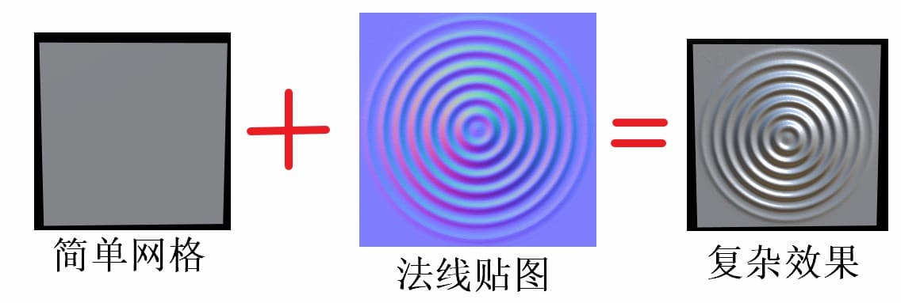
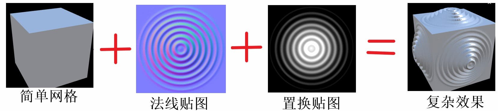
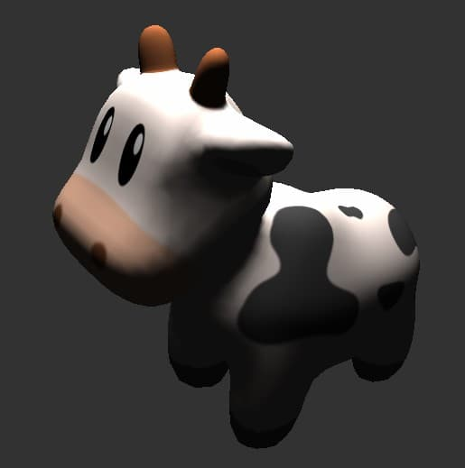
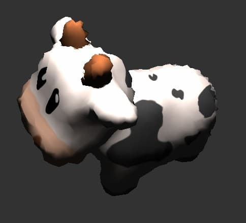
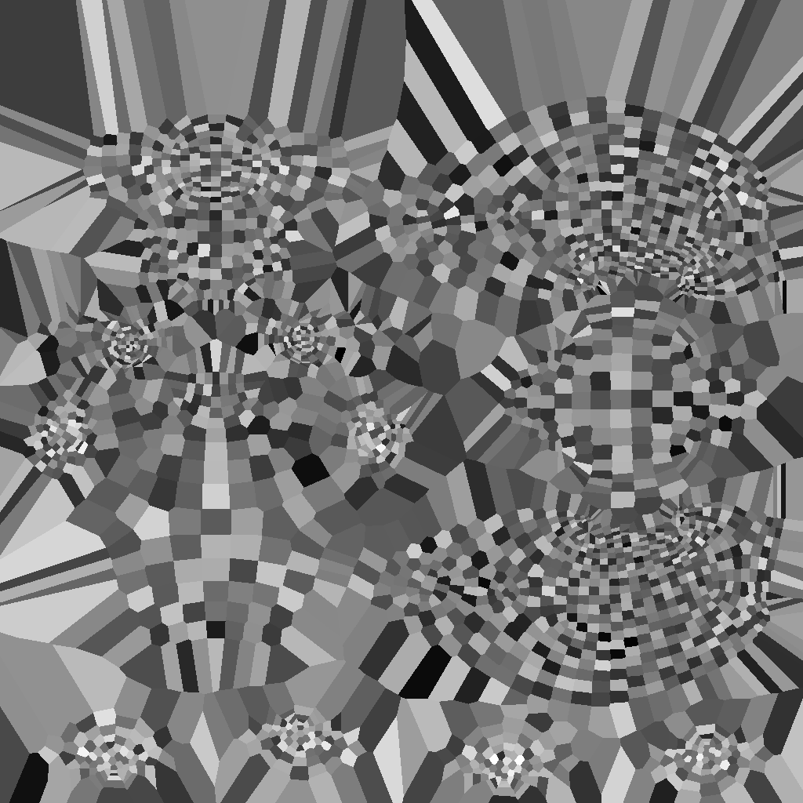
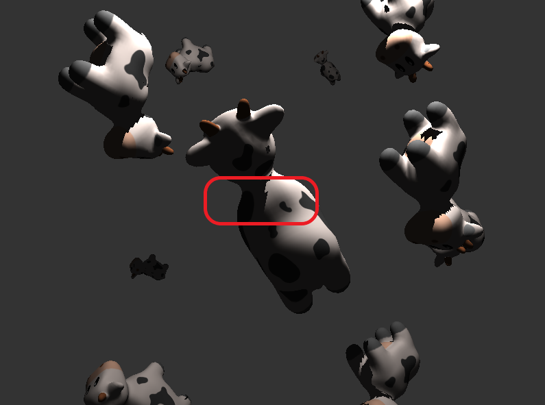

# Lab8 着色器

PB17111585 张永停

### 一、实验要求

- 实现 normal map 和 displacement map
- 利用 displacement map 在 vertex shader 中进行简单降噪
- 实现点光源阴影

### 二、算法描述

#### （一）法向贴图

- 法线贴图在渲染中用于改变原法向，从而影响着色效果。

- 由于法线贴图中的法线向量定义在切线空间中，在切线空间中，法线永远指着正z方向。因此应使用一个特定的矩阵将本地/切线空间中的法线向量转成世界或视图空间下，使它们转向到最终的贴图表面的方向。
- 只需在顶点着色器计算T、B、N，在片段着色器中使用TBN矩阵把切线坐标空间的向量转换到世界坐标空间，这	样所有法线和其他光照变量就在同一个坐标系中了。

#### （二）置换贴图

- 置换贴图用于改变顶点的位置，0 （黑色）表示不动，1（白色）表示沿着法向偏移。

- 将置换贴图的值转换成顶点偏移量

  displacement = lambda * (-1 + 2 * pixel value)

- 由于置换贴图只改变了顶点的位置，不改变顶点的法向，所以应添加相应的法线贴图。

#### （三）置换贴图去噪

##### （i）普通去噪

- 虽然给顶点加了噪声，但法线还是用了原本的，所以含噪声模型在渲染的不同主要体现在纹理的扭曲和边缘的凹凸不平上。我们只需将顶点进行合理的偏移。
- 计算每个顶点的偏移量

$$
\delta_i=p_i-\frac{1}{|N(i)|}\sum_{j\in N(i)}p_j
$$

- 将偏移量投影到法向上

$$
\bar{\delta}_i=\langle\delta_i,\pmb{n}_i\rangle \pmb{n}_i
$$

- 对每一个顶点进行偏移

$$
\bar{p}_i=p_i-\lambda \bar{\delta}_i=p_i-\lambda\langle\delta_i,\pmb{n}_i\rangle \pmb{n}_i
$$

- 将 $\langle\delta_i,\pmb{n}_i\rangle$ 存到置换贴图中，并设置好 bias 和 scale 将值变换到 0 和 1 之间。这里我采用

$$
\delta_i^{'}=\frac{\delta_i-min}{max-min}
$$

​		即，$scale=max-min$，$bias=min$

##### （ii）最邻近插值

- 由于模型的顶点数远小于1024*1024，这会造成置换贴图非常稀疏，在采样过程中便会出现误差。这里我们采用ANN库的最邻近算法进行插值得到完整的置换贴图。
- 对于不是顶点的像素点，使用最邻近算法将与之最近的顶点的深度(即偏移量)赋值给它

#### （四）点光源阴影

##### 	(i)阴影映射

- 以光的位置为视角进行渲染，能看到的东西都将被点亮，看不见的一定是在阴影之中了。假设有一个地板，在光源和它之间有一个大盒子。由于光源处向光线方向看去，可以看到这个盒子，但看不到地板的一部分，这部分就应该在阴影中了。

  

- 如果绘制一条从光源出发，到达最右边盒子上的一个片段上的线段或射线，那么射线将先击中悬浮的盒子，随后才会到达最右侧的盒子。结果就是悬浮的盒子被照亮，而最右侧的盒子将处于阴影之中。

- 得到射线第一次击中的那个物体，然后用这个最近点和射线上其他点进行对比。然后测试一下看看射线上的其他点是否比最近点更远，如果是的话，这个点就在阴影中。

- 从光源的透视图来渲染场景，并把深度值的结果储存到纹理中

  

  通过储存到深度贴图中的深度值，就能找到最近点，用以决定片段是否在阴影中。我们使用一个来自光源的视图和投影矩阵来渲染场景就能创建一个深度贴图。这个投影和视图矩阵结合在一起成为一个$T$变换，它可以将任何三维位置转变到光源的可见坐标空间。

##### (ii)深度贴图

- 深度贴图是从光的透视图里渲染的深度纹理，用它计算阴影
- 为光源使用正交投影矩阵，同时为了创建一个视图矩阵来变换每个物体，把它们变换到从光源视角可见的空间中，使用look_at函数；这次从光源的位置看向场景中央。二者相乘便得到了光空间的变换矩阵lightSpaceMatrix，它将每个世界空间坐标变换到光源处所见到的那个空间。
- 顶点着色器将一个单独模型的一个顶点，使用lightSpaceMatrix变换到光空间中。

##### (iii)渲染阴影

- 在片段着色器中执行，用来检验一个片段是否在阴影之中
- 把光空间片段位置转换为裁切空间的标准化设备坐标，自己做透视除法` fragPosLightSpace.xyz / fragPosLightSpace.w;`
- 根据投影坐标，我们就能从深度贴图中采样得到0到1的结果，从第一个渲染阶段的projCoords坐标直接对应于变换过的NDC坐标。我们将得到光的位置视野下最近的深度
- 为了得到片段的当前深度，只需要简单获取投影向量的z坐标。
- 实际的对比就是简单检查currentDepth是否高于closetDepth，如果是，那么片段就在阴影中。

##### (iv)阴影失真

- 图片中有明显的线条样式

  

  因为阴影贴图受限于分辨率，在距离光源比较远的情况下，多个片段可能从深度贴图的同一个值中去采样。

- 用阴影偏移来解决这个问题，简单的对表面的深度应用一个偏移量，这样片段就不会被错误地认为在表面之下了。

##### (v)采样过多

- 由于光的视锥不可见的区域一律被认为是处于阴影中，不管它真的处于阴影之中。
- 只要投影向量的z坐标大于1.0，我们就把shadow的值强制设为0.0

##### (vi)分辨率问题

- 因为深度贴图有一个固定的分辨率，多个片段对应于一个纹理像素。结果就是多个片段会从深度贴图的同一个深度值进行采样，这几个片段便得到的是同一个阴影，这就会产生锯齿边。
- 从深度贴图中多次采样，每一次采样的纹理坐标都稍有不同。每个独立的样本可能在也可能不再阴影中。所有的次生结果接着结合在一起，进行平均化，就得到了柔和阴影。

### 三、实验结果

##### （一）法向贴图

##### （二）置换贴图

##### （三）置换贴图去噪

<figure class="half">
        
        
</figure>

<i>左 ：原图  右：加噪声 </i>

<figure class="half">
        
        
</figure>

<i>左 ：降噪后结果 右：深度图(插值后)</i>

##### （四）点光源阴影

- 无阴影偏移

  

- 添加阴影偏移，无PCF，可以明显看到图中过度成锯齿状

  

- ​	添加PCF，可以看到过度柔和许多

  

### 四、实验感想

- 本次实验学习了OpenGL的用法，同时也学习了KNN的算法
- 这次又被1/int=0坑了一次，这个bug找了好久才找到
- 由于没有N卡，本次实验Debug过程巨难，有一次main里定义的`matrix`，在着色器里写的是`matirx`，这个问题找了好久好久
- 所幸本次实验文档详细，学到了很多有关渲染的东西